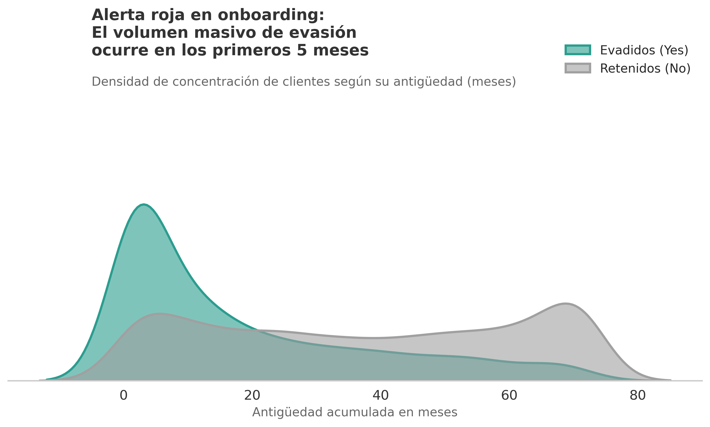
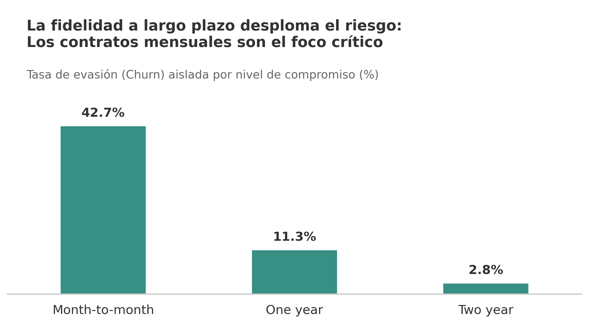
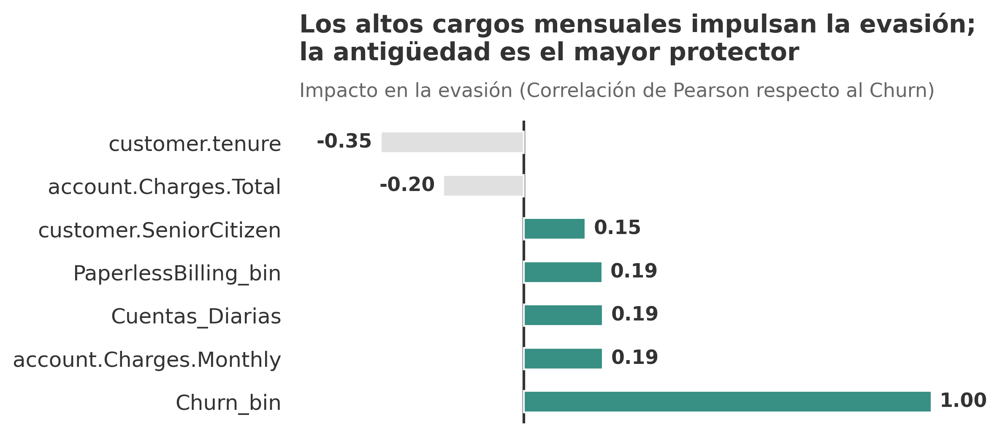

# 📉 Telecom X Latam: Estrategia de Retención y Análisis Predictivo de Churn

[](https://colab.research.google.com/github/eppursimuove9/telcom_x/blob/main/TelcomX_Latam.ipynb)

Este repositorio contiene un análisis de datos integral (EDA) y la arquitectura de ingeniería de características (*Feature Engineering*) orientada a resolver uno de los problemas financieros más críticos en la industria de telecomunicaciones: la evasión de clientes (*Customer Churn*).

---

## 1. Síntesis Ejecutiva

El modelo de retención actual de Telecom X presenta una vulnerabilidad estructural en las etapas tempranas del ciclo de vida del cliente. La fuga de capital no es uniforme, sino que está hiperconcentrada en un arquetipo específico: **clientes recientes, bajo contratos sin amarre (mensuales) y con altos cargos de facturación.** Para proteger los ingresos, la compañía debe transicionar urgentemente de una retención reactiva a un modelo de fidelización proactiva desde el día cero.

---

## 2. Diagnóstico de Negocio (Key Insights)

### 🚨 Crisis de retención en el Onboarding (Meses 0-5)
La antigüedad actúa como el principal escudo protector contra la evasión; sin embargo, el mayor volumen de abandonos ocurre durante los primeros meses. Se están perdiendo clientes antes de que logren consolidarse, destruyendo el *Lifetime Value* (LTV) proyectado.



### 🔓 Falta de lock-in comercial
El riesgo de evasión está acaparado casi en su totalidad por los contratos mensuales. La ausencia de un compromiso a largo plazo (contratos de 1 o 2 años) elimina las barreras de salida y facilita un abandono sin fricción para el cliente.



### 💸 Fractura en la propuesta de valor High-Ticket
Existe una correlación directa y positiva entre el nivel de facturación (cargos diarios/mensuales) y la probabilidad de *churn*. Los clientes que más pagan son los que más rápido se van, lo que indica que el valor percibido del servicio actualmente no justifica el precio premium.



---

## 3. Plan de Acción Estratégico (Recomendaciones)

* **🎯 Forzar la migración a largo plazo (Upselling):** Diseñar una estructura de *pricing* o incentivos agresivos de entrada que hagan financieramente irracional elegir un contrato mensual frente a uno anual.
* **🛡️ Blindar los primeros 180 días:** Implementar un programa de *Customer Success* focalizado exclusivamente en clientes nuevos para garantizar la adopción del servicio y mitigar la fricción.
* **🔍 Auditar planes de alto costo:** Detener la hemorragia en el segmento de mayor facturación revisando los beneficios asociados a las tarifas más altas para alinear el costo con un valor percibido superior.
* **🤖 Desplegar motor predictivo:** Utilizar esta "triada de vulnerabilidad" (Contrato, Antigüedad, Cargos) como base para entrenar un modelo de *Machine Learning* que identifique clientes con alta probabilidad de fuga antes de que soliciten la baja.

---

## 4. Estructura del Repositorio

El proyecto sigue una estructura estandarizada para facilitar la reproducibilidad y escalabilidad del análisis:

```text
telcom_x/
│
├── assets/                 # Gráficos de alta resolución exportados del EDA
├── README.md               # Documentación ejecutiva del proyecto
├── TelcomX_Latam.ipynb     # Notebook principal con limpieza, EDA y Feature Engineering
└── requirements.txt        # Dependencias y librerías necesarias para ejecutar el entorno
```

## 5. Reproducibilidad
Para clonar y ejecutar este proyecto localmente:

Clona el repositorio:

```bash
git clone [https://github.com/eppursimuove9/telcom_x.git](https://github.com/eppursimuove9/telcom_x.git)
```

```bash
pip install -r requirements.txt
```

## 6. Stack Tecnológico

Este análisis fue desarrollado íntegramente en Python, priorizando un código limpio, modular y orientado a la eficiencia computacional:

* **Manipulación y limpieza de datos:** `pandas`, `numpy` (Aplanamiento de JSON, imputación de nulos, Feature Engineering).
* **Visualización de alto impacto:** `matplotlib`, `seaborn` (Diseño de gráficos con formato ejecutivo y alta densidad de información).
* **Entorno:** Jupyter Notebook / Google Colab.

## 7. Sobre el Dataset

Los datos utilizados para este proyecto provienen de una muestra representativa de la industria de telecomunicaciones, enfocada en métricas de retención mensual, variables demográficas, tipos de suscripción y comportamiento de pago. El proceso incluyó la desanidación de estructuras complejas (JSON) para convertirlas en variables tabulares viables para el modelado.

## 8. Autor y Contacto

**Alex Rojas Segovia** *Estratega de Datos y Negocios*

Si te interesa profundizar en el enfoque estratégico de este análisis o discutir oportunidades de colaboración, no dudes en conectar conmigo:

* LinkedIn: [Perfil de LinkedIn](https://www.linkedin.com/in/alexrojassegovia/)
* [Email](mailto:alexrojas8922@gmail.com)
